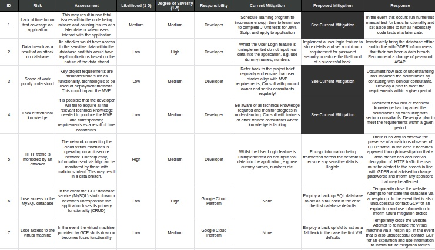
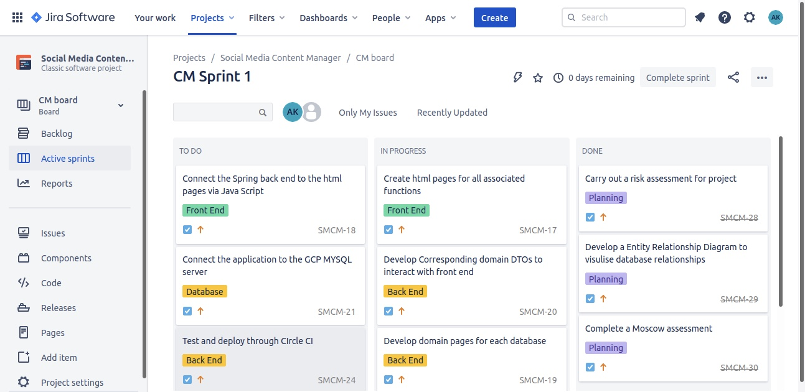
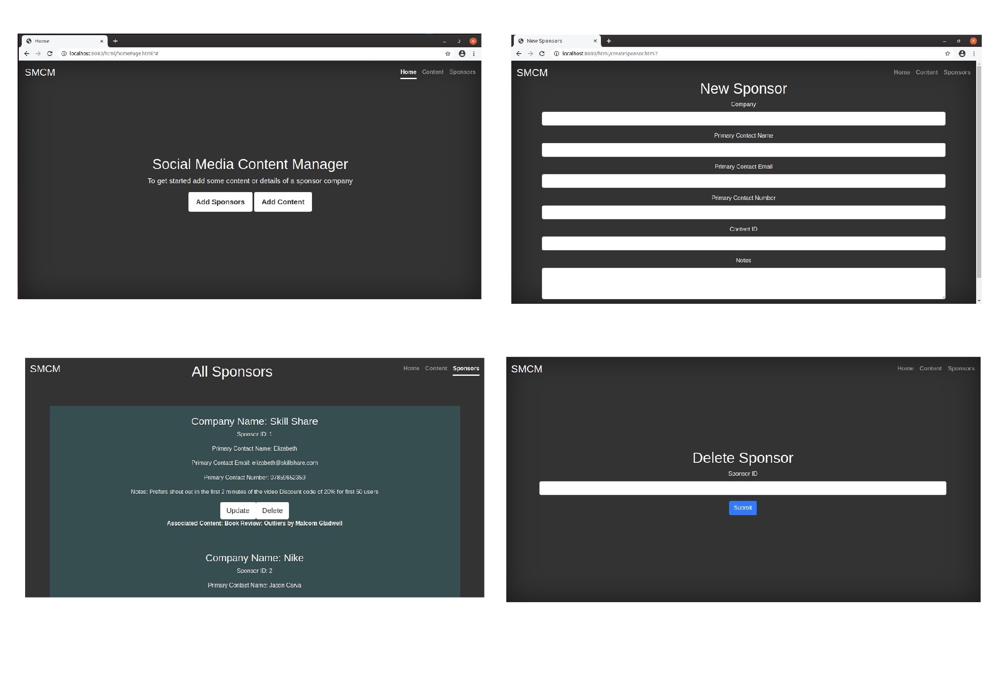

# SFIA Project 1:
## Social Media Content Manager

### Contents 
* Project Brief 
  * Objective
  * Minimum Requirements
  * Constraints 
* Application Overview 
  * Description
  * Functionality 
* Risk Assessment 
* Project Tracking 
* Architecture 
  * Database Structure 
  * CI Pipeline
* Testing 
* Front End Design
* Issues
* Improvements

### Project Brief
**Objective:** 

Create a CRUD application that demonstrates an understanding of key concepts, tools and methodologies as outlined in the _QA Cloud Native_ core modules. 

**Minimum Requirements:** 
1. Demonstrate agile working through devloped kanban board 
2. Detailed risk assessment
3. A relational database used to store project data 
4. Create an Application in the OOP language that meets the requirements outlined in the kanban board
5. Develop a functioning front end website and integrated API for application
6. Employ fully designed test suites and ongoing automated testing for application validation
7. Meet acceptable level of test coverage and supply reports to support this
8. Integrate code into a Version Control System
9. Build Code through a CI server 
10. Deploy the application through a cloud based virtual machine

**Constraints:**
| Technology           | Constraint  |
| -----------          | ----------- |
| Kanban Board         | Jira        |
| Database             | GCP Managed SQL Server|
| Programming language | Java|
| Front-End            | HTML, CSS and JavaScript |
| Unit Tests           | JUnit and Mockito |
| Integration Test     | Selenium |
| Version Control      | Git      |
| CI Server            | CircleCI  |
| Cloud server         | GCP virtual machine   |

### Application Overview:
**Description:**

This application is designed to allow users to store manage their social media content posts through idea phase to successful post.

**Functionality:**

The Application allows users to do the following :
* Enter data on indiviual posts with the folllowing details (CREATE)
  * Title of the Post **_e.g Scholarship Announcement_**
  * Content Type **_e.g Infographic_**
  * Social Media Platform **_e.g Instagram_**
  * Content Status **_e.g Editing_**
  * Projected Post Date **_e.g 05/09/2020_**
  * Sponsors **_connected to database below_**
* Store contact details for content sponors (CREATE)
  * Company Name 
  * Primary Contact Name
  * Primary Contact Email
  * Primary Contact Phone Number
  * Notes 
* View all these inputs (READ)
* Update existing sponsor entries (UPDATE)
* Delete sponsor entries (DELETE)

### Risk Assessment 
A full risk assessment was carried out before project commencenment and was monitored throughout. It includes mitigation at present but additionally, proposed mitigation in the event of more time and resources. The assessment includes risks associated with developer and technologies employed. 

The risk assessment for this project can be found in full here:
https://docs.google.com/spreadsheets/d/1NaXPK0vTBx11zCeguTTU5OSshmogoGkOOSU5_KN_VTw/edit#gid=0

A quick overview is as follows:

### Project Tracking 
Jira's Kanban board was employed to track project progress, in line with agile working principles. The full board with all sprints and users stories can be found at the following link:

### Architecture

### Testing 

### Front End Design 
Given the time constraint and technical knowledge level the front end is relatively basic at this stage but allows for CRUD fucntionality. It was designed using html and CSS. 

### Issues

### Future Improvements 
1. Sign in page as a dashboard with key statistics for content creators to track volume of content per platform, and content type. Additionally, can view proportion of sponsored vs non-sponsored posts
2. Conditional drop down meanu when inputting content e.g if Instagram platform selected then default content type options = image, video, story, reel

